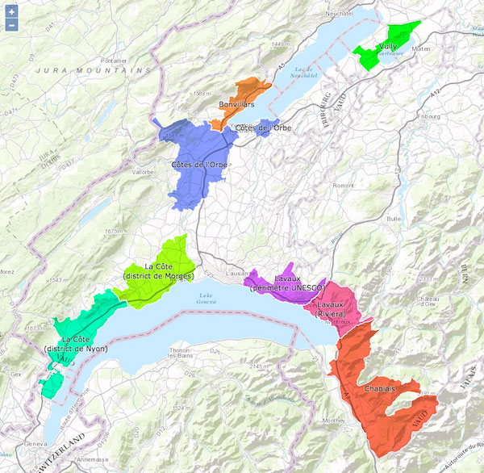

# Example map with OpenLayers and GeoJSON

This example map shows how to create a GeoJSON overlay with OpenLayers, using 'multiply' as blending mode and normal blending mode for stroke and labels.

Here is an image how the map looks like:

A live version can be viewed [here](https://cdn.rawgit.com/christiankaiser/ol-geojson-blending/fc971a4a7eda5f5208fba98302006b026aa21d89/index.html).
